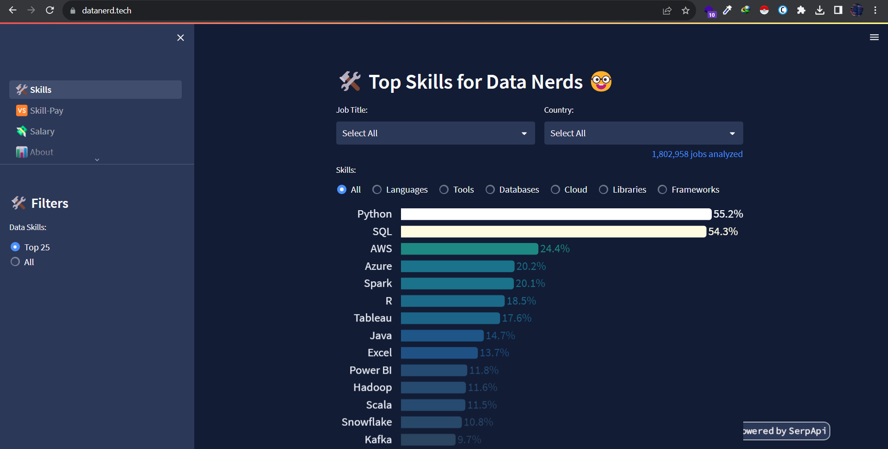

# SQLGP: Query Your MySQL Database Without Coding Knowledge

SQL is a crucial skill in data-related jobs like data science, analytics, and engineering. It's the language we use to talk to databases and extract insights. In this project, I enhanced Language Models (LLMs) with LangChain. The goal was to make querying databases and asking questions accessible to everyone, even those without SQL knowledge. It's about simplifying data analysis using SQL for all

### Proejct Overview

## 1- Collecting Data:
While LangChain initially offers robust functions for connecting to databases and executing basic queries, my aim was to take it a step further. I wanted to enhance the Language Models (LLMs) to comprehend more intricate questions. To achieve this, I scraped free medium and easy-level questions from LeetCode, capturing the most popular and correct answers. These were then stored in a CSV file using Selenium.

Additionally, I leveraged code from one of my previous projects where advanced queries were employed to analyze the sales data of a hardware manufacturing company. This dual approach, combining real-world data scenarios with curated problem-solving insights, serves to refine and advance the capabilities of LangChain for more sophisticated data interactions.

## 2- Embadding:
"Language Models (LLMs) struggle to understand text data naturally, seeing it as matrices or arrays of numbers. Each number carries meaning, helping LLMs grasp user intent. To overcome this, I transformed my data into understandable embeddings using BERT from Hugging Face. Check out the details in the documentation [here](https://python.langchain.com/docs/integrations/providers/huggingface).

## 3- Store Embaddings:
Next step is embadded collected data into a vector database. Why a vector database? Vector databases are the best data storage for LLMs and all the applications that uses embaddings or vectors as input because of the speed. I used a free and open source database called ChromaDB you can find more details about it [here](https://python.langchain.com/docs/integrations/vectorstores/chroma).

## 4- Feed Data to Langchain and use fewshot learning:
LangChain offers a choice of 3 Language Models (LLMs): GPT-4 from OpenAI, a paid option; Llama from Meta, which is free but requires downloading due to its large size; and PaLM2 from Google, boasting 540 billion parameters, free, and operates as an API without the need for downloads—my preferred choice for this project.

In implementing this project, I employed Few-Shot Learning. When a user submits a question, the LLMs first utilize their inherent knowledge. If they find themselves unable to answer, they reference the provided data, striving to respond effectively.

## 5- UserInterface and Optimization:
For the user interface, I chose Streamlit, a Python library that simplifies the creation of web applications. The process is straightforward – you provide your database information, and the Language Models (LLMs) connect to it, ready to respond to your questions.

While the LLMs may not have answers to every question initially due to knowledge limitations, I've implemented a solution. Unanswered questions are collected and stored in a database weekly using Apache Airflow. These questions undergo human review for correction and are then added to a vector database, enhancing the model's knowledge over time.

## Future Updates: 

1- Query Transparency:
Display the query generated by the model along with its corresponding answer for better insight.

2- Human-Friendly Responses:
Enhance responses to be more human-like, improving the user experience.

3- Extended Data Source Support:
Enable the model to query not only databases but also .csv and Excel files, expanding its versatility.

4- Extended Database Compatibility:
Broaden connectivity by incorporating support for additional relational databases such as SQLite, PostgreSQL, SQL Server, and others.

5- Big Data and Spark SQL Integration:
Enable the model to handle queries on large datasets by integrating support for Big Data technologies like Spark SQL, enhancing scalability and performance.

## Libraries and Frameworks Used in the Project:
- chromadb 0.4.15
- langchain 0.0.284
- protobuf 3.19.0
- google-generativeai
- langchain_experimental
- mysql-connector-python
- pymysql
- streamlit 1.28.2
- sentence-transformers
- apache-airflow 2.7.1
